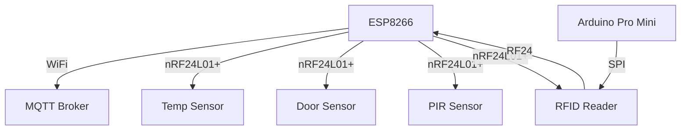

# RC522 RFID and RF24 Gateway

This project is an implementation of an RF24 gateway using an ESP8266 and an RC522 RFID reader. The gateway communicates with various sensors using the nRF24L01+ module and sends data to an MQTT broker.

## Functionality

- **RF24 Gateway**: Receives data from nRF24L01+ based sensors and sends it to an MQTT broker.
- **RFID Reader**: Reads RFID tags and checks if they are authorized. Sends the data to the gateway.
- **MQTT Communication**: Publishes sensor data to an MQTT broker.
- **OTA Updates**: Supports Over-The-Air (OTA) updates for the ESP8266.

## Structure

The project consists of the following main files:

- `rf24gatewayV4.2.ino`: The main gateway code for the ESP8266.
- `main_rf24_rc522.ino`: The code for the Arduino Pro Mini with the RC522 RFID reader.
- `secrets.h`: Contains WiFi, MQTT, and OTA credentials.

## Libraries

The following libraries are used in this project:

- `SPI.h`: For SPI communication.
- `nRF24L01.h` and `RF24.h`: For nRF24L01+ communication.
- `ESP8266WiFi.h`: For WiFi connectivity.
- `PubSubClient.h`: For MQTT communication.
- `ESP8266mDNS.h`, `WiFiUdp.h`, and `ArduinoOTA.h`: For OTA updates.
- `MFRC522.h`: For RFID reader.
- `LowPower.h`: For power management on the Arduino Pro Mini.

## Secrets

The `secrets.h` file contains the following definitions:

```cpp
#ifndef SECRETS_H
#define SECRETS_H

// WiFi credentials
#define WIFI_SSID "your_wifi_ssid"
#define WIFI_PASSWORD "your_wifi_password"

// MQTT credentials
#define MQTT_SERVER "your_mqtt_server_ip"
#define MQTT_USER "your_mqtt_username"
#define MQTT_PASSWORD "your_mqtt_password"

// OTA password
#define OTA_PASSWORD "your_ota_password"

#endif
```

## Diagram



## Setup

1. **ESP8266 Setup**:
   - Flash the `rf24gatewayV4.2.ino` code to the ESP8266.
   - Ensure the `secrets.h` file is correctly filled with your credentials.

2. **Arduino Pro Mini Setup**:
   - Flash the `main_rf24_rc522.ino` code to the Arduino Pro Mini.
   - Connect the RC522 RFID reader and nRF24L01+ module as per the pin definitions.

3. **MQTT Broker**:
   - Set up an MQTT broker and ensure the ESP8266 can connect to it using the credentials in `secrets.h`.

4. **OTA Updates**:
   - Use the OTA password defined in `secrets.h` for secure updates.

## Wiring

To wire up the RC522 RFID module to the Arduino Pro Mini 3.3V, you need to connect the pins as follows:

| RC522 Pin | Arduino Pro Mini Pin | Notes |
|-----------|---------------------|-------|
| SDA (SS)  | 8                  | Defined as `SS_PIN` in code |
| SCK       | 13                 | SPI Clock |
| MOSI      | 11                 | SPI MOSI |
| MISO      | 12                 | SPI MISO |
| IRQ       | *not connected*    | Not used in this project |
| GND       | GND                | Ground |
| RST       | 9                  | Defined as `RST_PIN` in code |
| 3.3V      | 3.3V               | Power |

Important notes:
- The Arduino Pro Mini 3.3V/8MHz version is the correct choice since the RC522 operates at 3.3V.
- Never connect the RC522 to 5V as it may damage the module.
- The connections use the hardware SPI pins of the Pro Mini (11, 12, 13).

Here's a visual representation of the Arduino Pro Mini pinout for reference:

```
       Arduino Pro Mini 3.3V
    _________________________
   |                         |
   |             TX1        |
   |             RX0        |
RST |             RST       |
GND |             GND       |
2   |                       |
3   |                       |
4   |                       |
5   |                       |
6   |                       |
7   |                       |
8   |             A0        | 
9   |             A1        |
10  |             A2        |
11  |             A3        |
12  |                       |
13  |                       |
    |_______________________|
```

## Usage

- Power on the ESP8266 and Arduino Pro Mini.
- The ESP8266 will connect to WiFi and start listening for data from the nRF24L01+ sensors.
- The Arduino Pro Mini will read RFID tags and send the data to the ESP8266 via the nRF24L01+ module.
- The ESP8266 will publish the sensor data to the MQTT broker.


