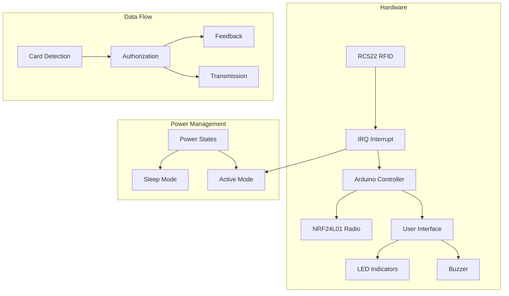
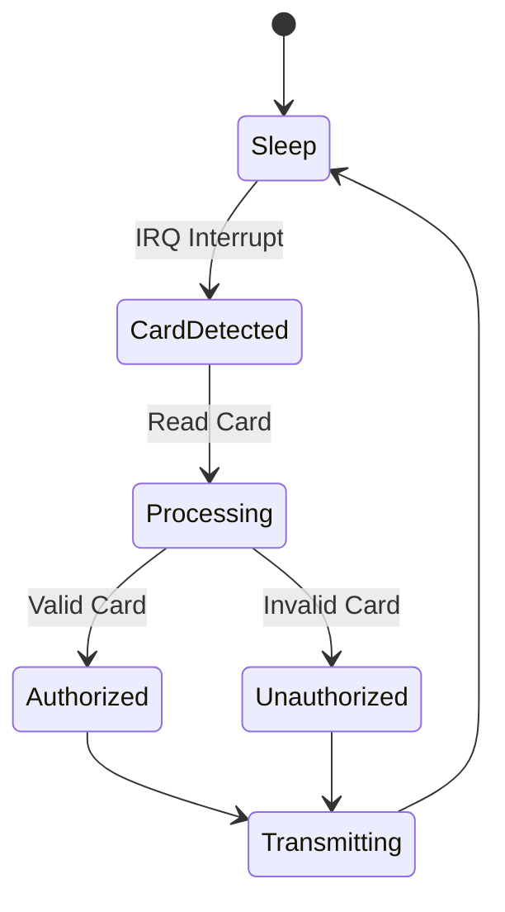
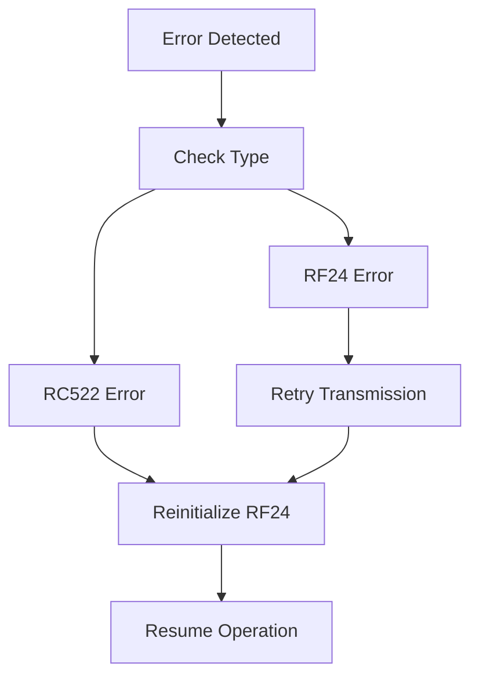
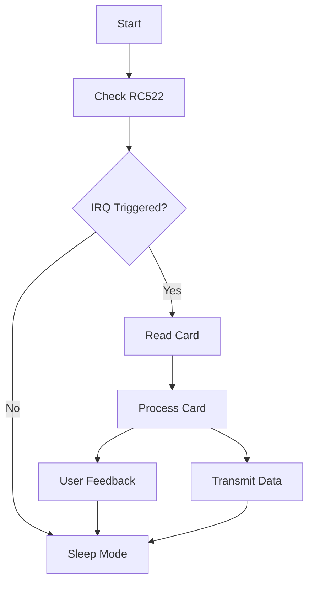

# RFID Reader System Patterns

## System Architecture



## Key Design Patterns

### 1. Interrupt-Driven Architecture
- Uses RC522's IRQ pin for efficient card detection
- Replaces polling with interrupt-based wakeup
- Reduces power consumption in idle state

### 2. State Management


### 3. SPI Bus Sharing
- Managed access between RC522 and NRF24L01
- Explicit configuration switching
- Protected transactions using beginTransaction/endTransaction

### 4. Power Management Strategy
- Sleep mode during idle periods
- Wake on interrupt only
- Optimized power states for different operations

### 5. Error Recovery Patterns


## Component Interactions

### 1. RC522 RFID Reader
- Primary Patterns:
  * Interrupt-based detection
  * Error recovery with reinitialization
  * SPI bus management

### 2. NRF24L01 Radio
- Primary Patterns:
  * Retry logic for failed transmissions
  * Power state management
  * SPI bus sharing

### 3. User Interface
- Primary Patterns:
  * State-based feedback
  * Synchronized visual and audio signals
  * Error indication

## Code Organization

### 1. Main Loop Structure


### 2. Function Categories
1. **Setup Functions**
   - Hardware initialization
   - Component configuration
   - Interrupt setup

2. **Core Operations**
   - Card detection
   - Authorization
   - Data transmission

3. **Support Functions**
   - SPI configuration
   - Error handling
   - Power management

4. **Feedback Functions**
   - LED control
   - Buzzer patterns
   - Status indication

## Data Structures

### 1. Card Data
```cpp
struct {
  uint32_t card_id;
  bool authorized;
  float batt;
  unsigned char sensor_id;
} sensorData5;
```

### 2. Configuration Constants
- Pin assignments
- Timing values
- Radio settings
- Authentication data
