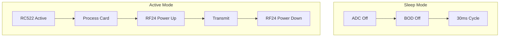
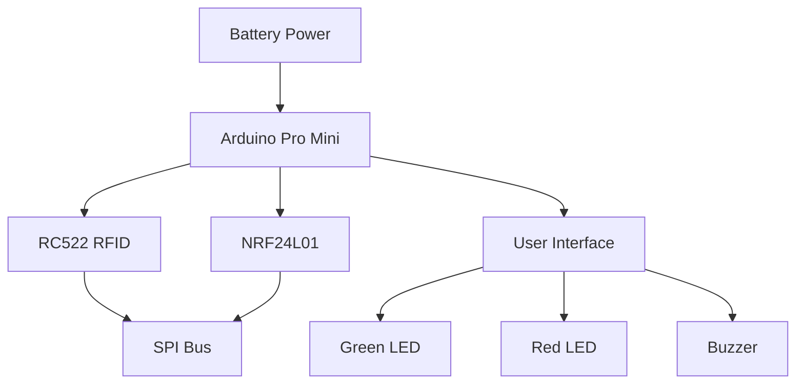
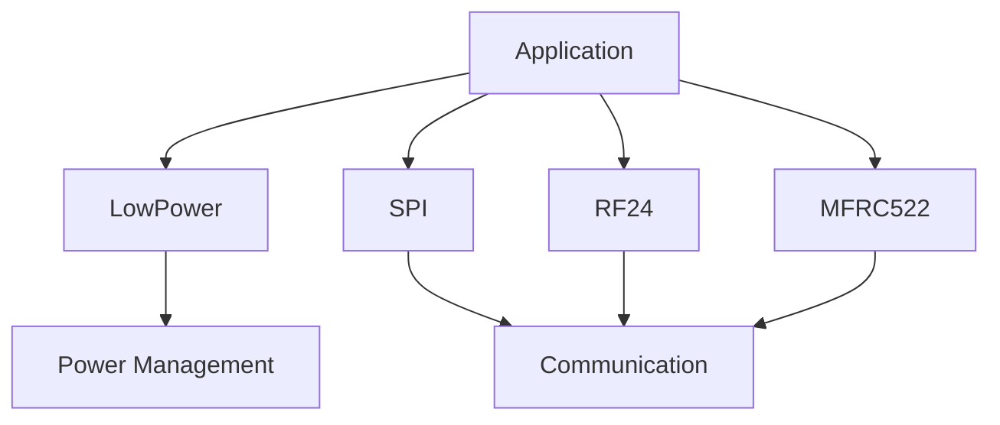

# Technical Context

## Development Environment

### Hardware
- Arduino Pro Mini 3.3V/8MHz
- MFRC522 RFID Module
- NRF24L01+ Radio Module
- LEDs (Green on Pin 6, Red on Pin 7)
- Piezo Buzzer (Pin 3)
- Battery power system with voltage divider

### Required Libraries
1. **MFRC522**
   - Purpose: RFID card reading/writing
   - Key features used:
     * Interrupt support
     * SPI communication
     * Crypto functions

2. **RF24**
   - Purpose: Wireless communication
   - Key features used:
     * Dynamic payloads
     * Auto-acknowledgment
     * Power management

3. **LowPower**
   - Purpose: Power management
   - Key features used:
     * Sleep modes
     * Power-down operations
     * ADC control

4. **SPI**
   - Purpose: Device communication
   - Key features used:
     * Bus sharing
     * Transaction management

## Technical Constraints

### Power Management
- Operating voltage: 3.3V
- Sleep current: < 1mA
- Active current: < 50mA
- Battery monitoring via voltage divider (R1=1.33kΩ, R2=330Ω)

**Sleep Mode Configuration**
- Uses LowPower library
- SLEEP_30MS intervals
- ADC_OFF during sleep
- BOD_OFF during sleep
- Immediate wake on card detection

**Device Power States**

**Power Consumption Patterns**
- RC522: Peak during card read
- NRF24L01: Peak during transmission
- LEDs: Brief activation only
- MCU: Deep sleep between checks

### Communication
1. **SPI Bus**
   - Maximum speed: 10MHz
   - Mode: 0 (CPOL=0, CPHA=0)
   - Shared between:
     * RC522 (SS_PIN 4)
     * NRF24L01 (CSN_PIN 14)

2. **RF24 Radio**
   - Channel: 108
   - Data rate: 250kbps
   - PA Level: High
   - CRC: 16-bit
   - Retry settings: 15 retries, 15*250µs delay

3. **RC522 RFID**
   - Operating frequency: 13.56 MHz
   - Maximum read range: ~3cm
   - Card support: Mifare Classic
   - Interrupt mode enabled

### Timing Requirements
- Card detection response: < 100ms
- LED feedback duration: 1s (auth) / 200ms x 3 (unauth)
- Radio retry interval: 100ms
- Sleep interval: 30ms

## Dependencies

### Hardware Dependencies

### Software Dependencies

## Build Configuration

### Memory Usage
- Program storage: < 32KB
- SRAM usage: < 2KB
- EEPROM: Not used

### Compilation Flags
- F_CPU=8000000L
- ARDUINO_AVR_PRO
- ARDUINO_ARCH_AVR

## Debug Support
- Serial output (115200 baud)
- LED status indicators
- Error reporting via serial
- Visual error indication
